# ai_chatbot - Django 智能对话系统 | Django AI Chatbot System

🔥 A Django chatbot system based on Python, MySQL, and web-based conversation management.  
🚀 Built for user administration, dialogue records, backend operations, and optional deep learning extensions.  
⭐ Supports chatbot workflows, admin dashboards, and a historical Seq2Seq-based dialogue module.

> 基于 **Python + Django + HTML + MySQL** 的聊天机器人系统，包含用户管理、问答记录管理与后台运维能力；并提供可选的深度学习对话子模块（`index/detection`）。

## 统一案例入口

> 以下命令默认从 `management-systems` 仓库根目录执行。

- 定位：archived learning project，适合作为 Django 用户、问答记录和后台运维样例。
- 技术栈：Django 3.2.x + MySQL + Layui + TensorFlow 1.x（可选）。
- 启动命令：`cd django/ai_chatbot && python manage.py runserver 8000`
- 验证命令：`cd django/ai_chatbot && pip install -r requirements/core.txt && python manage.py check`
- 截图/接口入口：截图见 `django/ai_chatbot/docs/docx-images/`；Web 入口 `http://127.0.0.1:8000`。

## 1. 项目说明

本项目对应“基于 Python 的 Django-HTML 深度学习聊天机器人设计与实现”思路，采用 Django 实现 Web 端业务流程，MySQL 持久化用户与问答数据，支持基础对话记录管理与后台管理。

默认情况下，系统可作为完整的 Web 聊天管理平台运行；若补齐旧版深度学习环境，可启用 `index/detection` 中的 Seq2Seq 推理能力。

## 2. 系统设计

### 2.1 总体架构

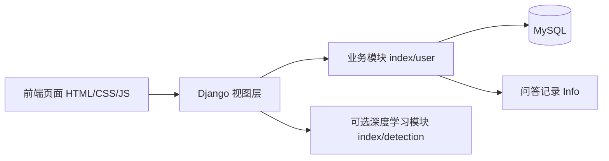

### 2.2 功能模块

- 用户模块：注册、登录、密码修改、用户列表分页与编辑删除
- 对话模块：接收提问、保存问答记录、返回对话结果
- 数据统计：首页展示近 7 天问答记录统计
- 后台管理：Django Admin + `simpleui` + `django-import-export`
- 深度学习子模块（可选）：基于 Seq2Seq/Attention 的历史实现

## 3. 深度学习模块设计图

### 3.1 Encoder-Decoder 结构

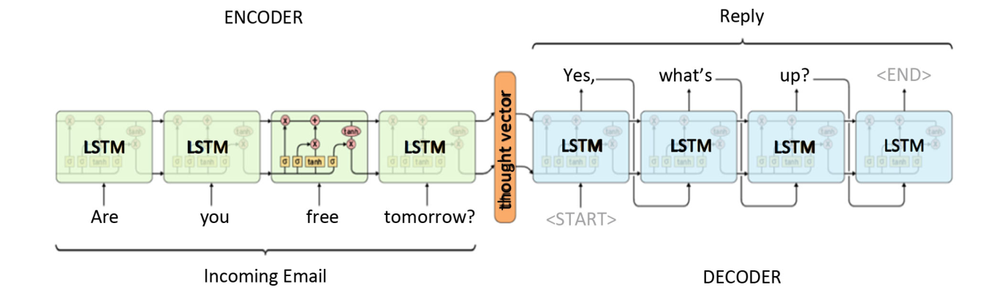

### 3.2 Attention 机制

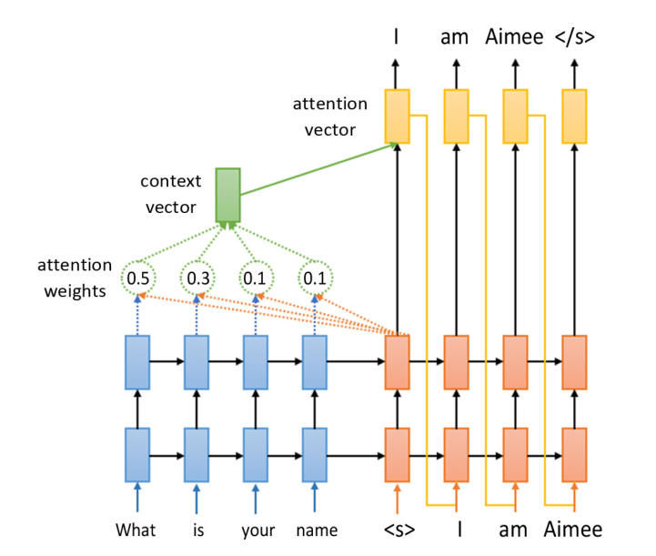

## 4. 技术栈

- 后端：Django 3.2.x
- 语言：Python 3.x
- 数据库：MySQL 8.x
- 前端：HTML/CSS/JavaScript + Layui 静态资源
- 可选 AI：TensorFlow 1.x（位于 `index/detection`）

## 5. 项目结构

```text
ai_chatbot
├── manage.py
├── website/                # Django 项目配置（settings/urls/wsgi）
├── index/                  # 首页、问答记录、数据展示
│   └── detection/          # 可选深度学习对话模块（TF1.x）
├── user/                   # 用户与角色模块
├── templates/              # 页面模板（login/index/user/personal 等）
├── static/                 # 前端静态资源
├── ai_chatbot.sql          # MySQL 初始化脚本
└── README.md
```

## 6. 运行步骤

### 6.1 安装依赖

推荐使用一键脚本（自动创建虚拟环境并安装依赖）：

```bash
./scripts/setup_env.sh
```

脚本行为：

- 创建 `.venv` 虚拟环境
- 安装 `requirements/core.txt`（Web 端最小依赖）
- 如不存在 `.env`，自动由 `.env.example` 复制生成
- 尝试执行 `python manage.py check`

如果需要启用 `index/detection` 的历史 TF1.x 子模块，可使用：

```bash
./scripts/setup_env.sh --with-detection
```

或手动安装 Web 最小依赖：

```bash
pip install -r requirements/core.txt
```

说明：

- `requirements/detection-legacy.txt` 为旧版依赖，推荐 Python 3.6/3.7 环境使用。
- 原始文件 `index/detection/requestments.txt` 仍保留（按原仓库命名）。

### 6.2 初始化数据库

1. 创建数据库：`ai_chatbot`
2. 执行 SQL 脚本：`ai_chatbot.sql`
3. 复制环境变量模板：`cp .env.example .env`
4. 在 `.env` 中填写 `DJANGO_SECRET_KEY` 与 `DB_PASSWORD`

### 6.3 启动服务

```bash
python manage.py runserver 8000
```

浏览器访问：`http://127.0.0.1:8000`

## 7. 测试账户

- 用户名：`admin`
- 密码：`123`

## 8. 系统功能实现

以下内容与配图依据文档《基于Python的Django-html基于深度学习的聊天机器人设计与实现》第 5 章整理。

### 8.1 登录注册功能

用户在未登录状态下只能浏览首页，访问其他功能时会提示先登录。用户可先进入注册页面完成账号注册，再返回登录页面输入用户名和密码完成登录。

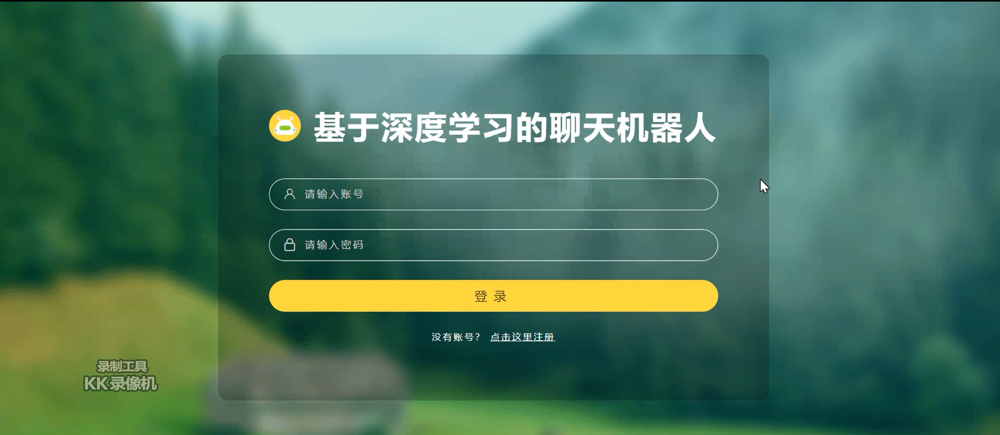

### 8.2 首页展示功能

用户在浏览器输入正确地址后可进入系统首页。首页整体采用左右布局，左侧为菜单与用户信息区域，右侧为数据与业务展示区域；登录后会显示当前用户名及功能入口。

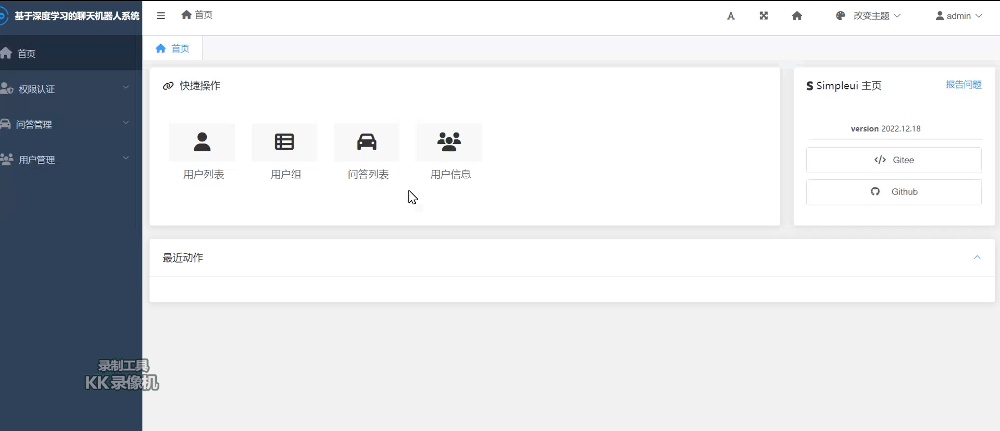

### 8.3 个人信息展示功能

该模块用于展示当前用户在系统内的基础资料，包括用户编号、姓名、联系方式、权限、注册时间和最后修改时间等信息，便于用户进行自查。

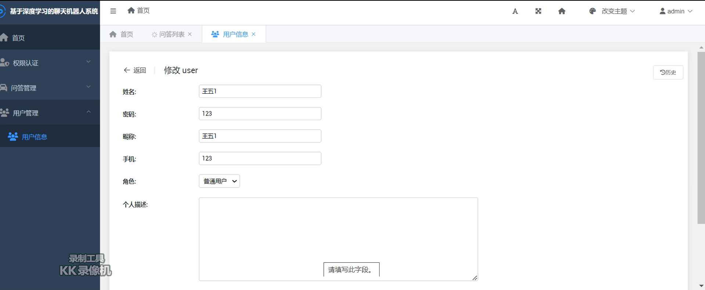

### 8.4 用户信息管理功能

用户信息维护包含用户查询与维护操作。管理员可通过姓名等条件检索用户数据，并执行编辑、删除等管理操作，实现对平台注册用户信息的统一维护。

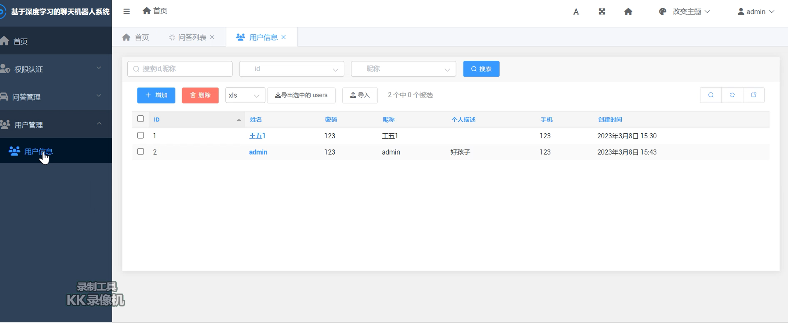

### 8.5 修改密码功能

用户在登录后可进入修改密码页面，输入新密码并再次确认。系统通过前端校验与后端处理完成密码更新，保证账号维护流程清晰可用。

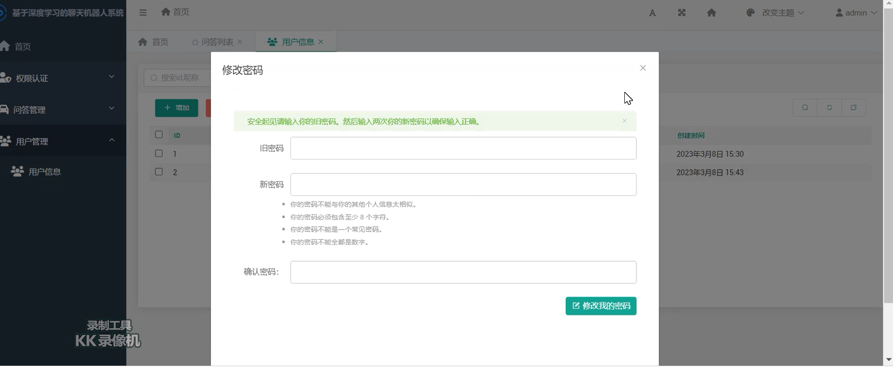

### 8.6 在线聊天功能

聊天界面展示历史对话记录。用户发送消息后，系统可返回对应回复；文档示例中输入“你几岁啦”后，系统返回“讨厌，不要问女生的年龄知道不”，实现基础陪伴式对话体验。

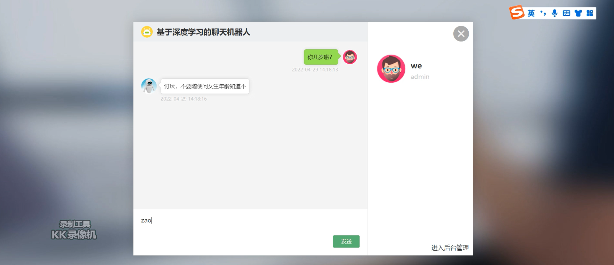

### 8.7 问答列表功能

系统可集中展示所有聊天与问答记录，列表中可查看用户消息、系统回复、操作人和状态等信息，并支持按条件检索，便于后续管理和追踪。

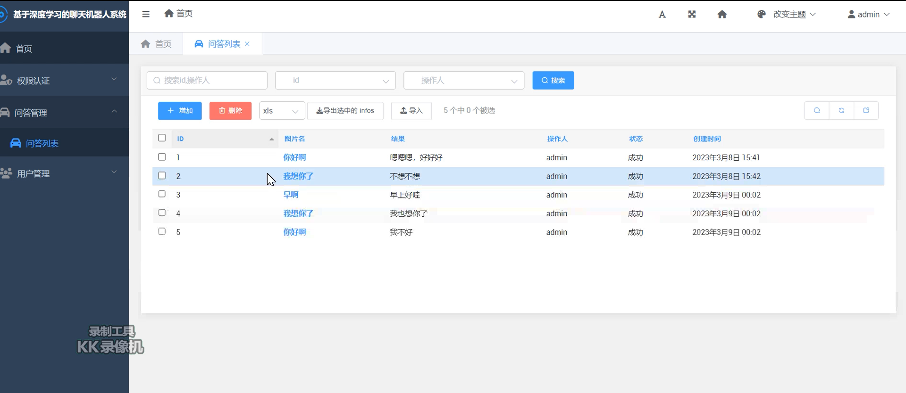

### 8.8 改变主题功能

系统内置多种主题与字体样式。用户点击右上角主题切换后，界面颜色和排版会随之变化，用于满足不同使用偏好。

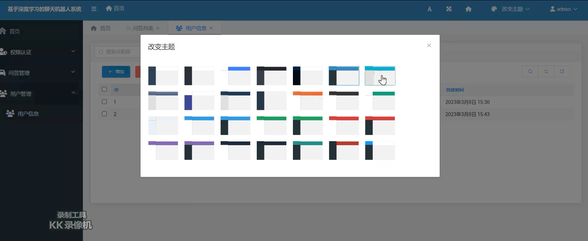

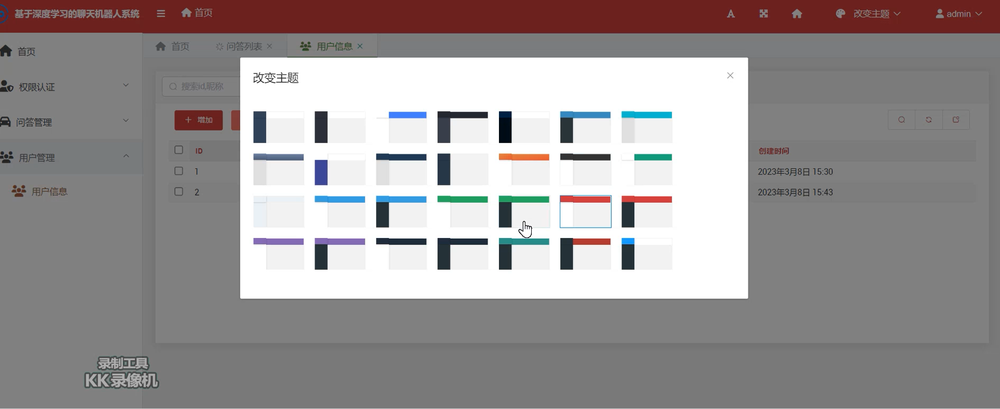

## 9. 系统测试

以下内容依据文档第 6 章整理。

### 9.1 测试目的

系统测试的核心目的是发现潜在功能缺陷并降低上线风险。即使界面完整，如果存在关键流程漏洞（如登录、注册、权限、数据写入异常），系统依然无法稳定投入使用。  
因此，本系统在开发后期将测试作为独立环节执行，确保预期结果与实际结果一致，并在发现问题后进行修复与回归验证。

### 9.2 测试内容

测试设备以开发者电脑为主，并辅以其他设备进行交叉验证。性能与并发相关场景通过 LoadRunner 及多浏览器窗口并行方式进行验证。  
文档以“注册模块”作为重点用例，测试样例与结果如下：

- 用例1：`用户名=123456，密码=123456，确认密码=123456`  
  预期：注册失败（用户名首位不能为数字且需满足长度规则）。  
  结果：与预期一致。
- 用例2：`用户名=zhangsan，密码=123，确认密码=123`  
  预期：注册失败（密码长度不足 6 位）。  
  结果：与预期一致。
- 用例3：`用户名=zhangsan，密码=123456，确认密码=12345`  
  预期：注册失败（密码与确认密码不一致）。  
  结果：与预期一致。
- 用例4：`用户名=zhangsan，密码=123456，确认密码=123456`  
  预期：注册成功并跳转首页。  
  结果：与预期一致。

### 9.3 测试总结

系统测试以黑盒测试为主，重点覆盖了登录状态校验、角色权限约束、表单校验和核心业务流程。  
整体结果与测试用例设计基本一致，发现的个别问题已在后续修改并复测后满足正常使用要求。

## 10. 安全与部署建议

- 生产环境请通过环境变量配置 `SECRET_KEY`、数据库连接、`ALLOWED_HOSTS`
- 上线前关闭 `DEBUG`
- 建议为登录、修改、删除等接口补充 CSRF 与权限校验
- 建议对密码进行哈希存储（当前为明文示例实现）

## 11. 常见问题

- 启动报数据库连接错误：检查 MySQL 是否启动、库名与账号密码是否正确
- 页面样式丢失：确认 `static/` 完整且 `STATICFILES_DIRS` 配置正确
- AI 对话不可用：`index/detection` 依赖旧版 TF1.x 和模型文件，需单独准备环境

## 12. License

本项目采用 MIT License，详见 [`LICENSE`](LICENSE)。
## Engineering Quality

This repository includes a contract-based quality baseline to keep essential engineering standards stable over time.

- Quality plan: [docs/ENGINEERING_QUALITY.md](docs/ENGINEERING_QUALITY.md)
- Contract tests: [tests/repo_contract_test.sh](tests/repo_contract_test.sh)
- Contract CI workflow: [.github/workflows/repo-contract-ci.yml](.github/workflows/repo-contract-ci.yml)

Run local contract checks:

```bash
bash tests/repo_contract_test.sh
```
