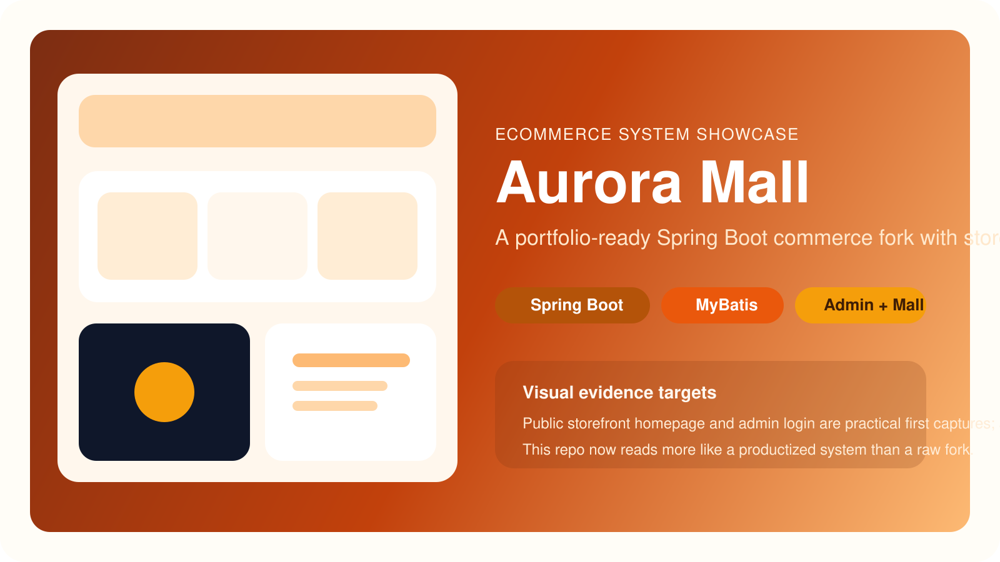

# Aurora Mall - 电商系统工程化实战项目 | E-commerce Productization Project

> **非官方声明（Non-Affiliation）**  
> 本仓库为社区维护的衍生/二次开发版本，与上游项目及其权利主体不存在官方关联、授权背书或从属关系。  
> **商标声明（Trademark Notice）**  
> 相关项目名称、Logo 与商标归其各自权利人所有。本仓库仅用于说明兼容/来源，不主张任何商标权利。


[](https://github.com/however-yir/aurora-mall/actions/workflows/consistency-check.yml)
[](https://github.com/however-yir/aurora-mall#readme)
[](./LICENSE)
[](https://github.com/however-yir/aurora-mall)

> Status: `fork-customized`
>
> Series: [nebulacms](https://github.com/however-yir/nebulacms) · [talentflow-hr](https://github.com/however-yir/talentflow-hr)
>
> Attribution: upstream license and redistribution notices are maintained in `NOTICE.md` and `THIRD_PARTY.md`.

Aurora Mall 是一个基于 Spring Boot 的商城系统二次开发项目，目标是把上游代码库改造成可持续演进、可作品集展示、可继续工程化重构的独立仓库。



## 统一案例入口

> 以下命令默认从 `management-systems` 仓库根目录执行。

- 定位：主推单体电商管理系统案例，覆盖商城前台、后台管理和工程化治理。
- 技术栈：Spring Boot + Thymeleaf + MyBatis + MySQL。
- 启动命令：`cd spring-boot/aurora-mall && cp .env.example .env && ./scripts/dev.sh all-local`
- 验证命令：`mvn -B compile -f spring-boot/aurora-mall/pom.xml`
- 截图/接口入口：封面见 `spring-boot/aurora-mall/docs/showcase/portfolio-cover.svg`；前台入口 `http://localhost:28089`，后台入口 `http://localhost:28089/admin/login`，接口说明见 `spring-boot/aurora-mall/docs/API.md`。

## 项目快照

- 定位：Java 电商系统二开与工程化整理仓库。
- 亮点：品牌清理、环境变量化配置、Docker 化、资源一致性校验。
- 最短运行路径：`cp .env.example .env && ./scripts/dev.sh all-local`
- 作品线关系：与 `NebulaCMS`、`TalentFlow HR` 共同组成 Java 全栈产品化系列。

## Java 全栈作品线分工

| Repo | 主要角色 | 技术侧重 | 最适合的展示点 |
| --- | --- | --- | --- |
| `NebulaCMS` | 内容平台 | 插件系统、WebFlux、Vue 3 | 插件生态、内容管理、平台化 |
| `TalentFlow HR` | 业务后台 | Spring Boot + Vue | 组织流程、人事场景、后台系统 |
| `Aurora Mall` | 电商系统 | Spring Boot + MyBatis | 商品交易、配置治理、质量门禁 |

## 1. 项目定位

- 用途：Java/Spring Boot 电商系统二开基座
- 当前阶段：品牌与工程结构迁移 + 配置安全化 + 路由资源一致性治理
- 适合场景：课程项目升级、求职作品集、私有业务原型

## 2. 与原版的主要差异

当前仓库已完成或正在进行以下改造：

- 项目命名与 Maven 坐标改为 `io.example:aurora-mall`
- Java 包名迁移到 `io.example.auroramall`
- 配置改为环境变量驱动（数据库、端口、上传目录）
- 新增 Dockerfile 与 docker-compose 编排
- 新增 `NOTICE.md`、`THIRD_PARTY.md`
- 后台模板/静态脚本命名统一到 `aurora_mall_*`
- 新增路由-模板-静态资源一致性检查脚本
- 新增 GitHub Actions 自动校验工作流
- 前台残留品牌文案清理（旧品牌词与历史域名）

## 3. 技术栈

- Java 8
- Spring Boot 2.7.5
- Thymeleaf
- MyBatis
- MySQL 8
- HikariCP

## 4. 目录结构

```text
src/main/java/io/example/auroramall
src/main/resources/templates
src/main/resources/static
src/main/resources/mapper
src/main/resources/application*.properties
scripts/dev.sh
scripts/check-route-template-assets.sh
.github/workflows/consistency-check.yml
```

## 5. 本地启动

### 5.1 服务依赖分级

必需（默认启动链路）：

- MySQL 8

可选（当前仓库默认代码路径未强依赖）：

- Redis
- Ollama

### 5.2 准备数据库

```bash
mysql -u root -p -e 'CREATE DATABASE aurora_mall_db CHARACTER SET utf8mb4 COLLATE utf8mb4_unicode_ci;'
mysql -u root -p aurora_mall_db < src/main/resources/aurora_mall_schema.sql
```

### 5.3 配置环境变量

复制 `.env.example` 并按本机环境修改：

```bash
cp .env.example .env
```

至少需要修改：

- `APP_PROFILE`：`local | dev | staging | prod`
- `APP_PORT`
- `APP_DB_URL`
- `APP_DB_USERNAME`
- `APP_DB_PASSWORD`
- `APP_UPLOAD_DIR`

### 5.4 启动应用（本地模式）

```bash
./scripts/dev.sh check-env
./scripts/dev.sh all-local
```

访问地址：`http://localhost:28089`

说明：

- `all-local` 会自动读取 `.env`、拉起 MySQL 容器并启动 Spring Boot。
- 如只想单独运行后端：`./scripts/dev.sh run-local`。
- 如只想管理 MySQL 容器：`./scripts/dev.sh mysql-up` / `./scripts/dev.sh mysql-down`。

### 5.5 展示路径与截图位建议

建议把 `Aurora Mall` 的作品集演示拆成前台与后台两条线：

| 场景 | 推荐入口 | 展示重点 |
|---|---|---|
| 商城首页 | `/` | 品牌化前台与商品入口 |
| 商品详情 / 购物车 | 站内商品流程 | 交易闭环与页面完成度 |
| 后台登录 | `/admin/login` | 管理系统入口与品牌独立性 |
| 后台管理页 | 登录后后台主页 | 商品、订单、配置治理能力 |

## 6. Docker 启动

`docker-compose.yml` 已改为环境变量优先：

```bash
docker compose --env-file .env up --build
```

默认 `compose` 仅包含 `app + mysql`，不包含 Redis/Ollama 服务。

可覆盖变量：

- `MYSQL_DATABASE`
- `MYSQL_USER`
- `MYSQL_PASSWORD`
- `MYSQL_ROOT_PASSWORD`
- `MYSQL_PORT`
- `APP_PROFILE`
- `APP_PORT`
- `APP_UPLOAD_DIR`

### 6.1 文档与接口入口

| 入口 | 路径 | 用途 |
|---|---|---|
| API 说明 | `docs/API.md` | 管理端与商城交互接口概览 |
| FAQ | `docs/FAQ.md` | 常见环境与运行问题 |
| 开发说明 | `docs/DEVELOPMENT.md` | 后续工程化改造参考 |
| 路由校验脚本 | `scripts/check-route-template-assets.sh` | 模板与静态资源一致性检查 |

## 7. 环境分层说明

已提供以下 profile 文件：

- `application-local.properties`
- `application-dev.properties`
- `application-staging.properties`
- `application-prod.properties`

默认 profile：`local`（可由 `APP_PROFILE` 覆盖）。

## 8. 一致性校验（强烈建议）

```bash
./scripts/check-route-template-assets.sh
```

脚本会检查：

- Controller 返回视图名是否有对应模板
- 模板中静态资源引用是否真实存在

CI（GitHub Actions）也会执行同样检查并跑 Maven 构建。

## 9. 继续改造成独立项目的建议

建议按这个顺序继续推进：

1. 安全改造：密码哈希从 MD5 升级到 BCrypt/Argon2
2. SQL 种子数据去默认弱口令与历史品牌信息
3. 业务重构：拆分超大 Service（尤其订单流程）
4. 测试补齐：订单、购物车、登录、后台管理核心路径
5. 升级路线：Java 17 + Spring Boot 3
6. 品牌资产替换：Logo、favicon、仓库描述、GitHub Topics

完整 35 项清单见：`docs/PROJECT_OWNERSHIP_CHECKLIST.md`

### 9.1 发布前收口建议

公开展示或交付前，建议再做三件事：

1. 重置后台默认管理口令并拆分 demo 种子数据。
2. 补齐首页、商品详情、购物车、后台首页的 4 张截图。
3. 把 `docs/API.md` 与 README 首页互链，形成更完整的对外入口。

## 10. 开源协议与合规

本仓库保留上游 GPL 许可证，请在分发前阅读：

- `LICENSE`
- `NOTICE.md`
- `THIRD_PARTY.md`
- `AURORA_BRAND_POLICY.md`

如果继续公开发布二开版本，请确保保留必要的许可与归属信息。

## 11. GitHub 仓库品牌元信息

为降低与上游仓库在品牌层面的混淆，建议同步更新仓库描述与 Topics：

```bash
gh repo edit however-yir/aurora-mall \
  --description "Aurora Mall: a Spring Boot commerce fork for portfolio-ready engineering and iterative product experiments." \
  --add-topic spring-boot \
  --add-topic mybatis \
  --add-topic thymeleaf \
  --add-topic ecommerce \
  --add-topic java \
  --add-topic aurora-mall
```

如果主题已存在旧值，可先执行 `gh repo view --json repositoryTopics`，再按需删除/新增。
## Engineering Quality

This repository includes a contract-based quality baseline to keep essential engineering standards stable over time.

- Quality plan: [docs/ENGINEERING_QUALITY.md](docs/ENGINEERING_QUALITY.md)
- Contract tests: [tests/repo_contract_test.sh](tests/repo_contract_test.sh)
- Contract CI workflow: [.github/workflows/repo-contract-ci.yml](.github/workflows/repo-contract-ci.yml)

Run local contract checks:

```bash
bash tests/repo_contract_test.sh
```
