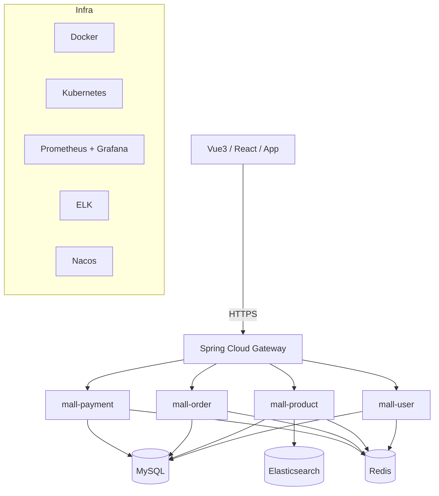

# Cloud Native Mall（云原生微服务商城）

🔥 一个面向电商场景的 Spring Cloud 微服务骨架项目，支持前后端分离架构。  
🚀 聚焦网关治理、服务拆分、容器化部署与可观测性，适合课程设计、校招项目升级与工程化实践。  
⭐ 当前版本包含可运行的网关 + 用户/商品/订单/支付四大服务 + 通用安全/监控/核心模块。


## 项目快照

- 项目名建议：`cloud-native-mall`（当前采用）
- 目标：基于 `aurora-mall` 的业务背景，从 Thymeleaf 单体形态升级为前后端分离 + 微服务架构
- 拆分思路：参考 `talentflow-hr` 的模块边界组织
- 认证模块：按 `DormLink` 的 JWT 方向沉淀到 `mall-common/common-security`

## 目录

- [1. 架构总览](#1-架构总览)
- [2. 核心亮点](#2-核心亮点)
- [3. 项目结构](#3-项目结构)
- [4. 技术栈](#4-技术栈)
- [5. 快速开始](#5-快速开始)
- [6. 默认联调账号](#6-默认联调账号)
- [7. 运维与部署](#7-运维与部署)
- [8. 文档导航](#8-文档导航)
- [9. 后续演进路线](#9-后续演进路线)

## 1. 架构总览



## 2. 核心亮点

| 亮点 | 实现方式 | 当前状态 |
|---|---|---|
| 服务注册与发现 | Eureka + `lb://service-name`（Nacos 可扩展） | ⭐⭐⭐ |
| API 网关 | Spring Cloud Gateway + JWT 统一鉴权 | ⭐⭐⭐ |
| 熔断降级 | Gateway + Resilience4j 依赖已接入 | ⭐⭐⭐ |
| 分布式事务 | Seata AT（订单链路已接入） | ⭐⭐⭐⭐ |
| 链路追踪 | OpenTelemetry + Jaeger OTLP | ⭐⭐⭐ |
| 容器化部署 | Docker Compose + K8s 清单 | ⭐⭐⭐⭐ |
| 监控告警 | Prometheus + Grafana + ELK | ⭐⭐⭐⭐ |
| 接口文档与契约 | Springdoc OpenAPI + MockMvc 契约测试 | ⭐⭐⭐ |
| 交付流水线 | GitHub Actions + Trivy + Canary 清单 | ⭐⭐⭐⭐ |

## 3. 项目结构

```text
cloud-native-mall/
├── mall-gateway/               # API网关
├── mall-user/                  # 用户服务
├── mall-product/               # 商品服务
├── mall-order/                 # 订单服务
├── mall-payment/               # 支付服务
├── mall-common/                # 公共模块
│   ├── common-core/            # 通用响应/分页模型
│   ├── common-security/        # JWT认证组件
│   └── common-monitor/         # 监控与Trace过滤器
├── docker/                     # Docker基础设施编排
│   ├── mysql/
│   ├── redis/
│   ├── elasticsearch/
│   └── prometheus/
├── k8s/                        # Kubernetes清单
│   ├── deployment/
│   ├── service/
│   ├── ingress/
│   └── canary/                 # 灰度发布清单
├── scripts/                    # 运维脚本
│   ├── build-all.sh
│   ├── deploy.sh
│   ├── deploy-canary.sh
│   └── monitor.sh
├── docs/                       # 文档
│   ├── architecture.md
│   ├── api-design.md
│   ├── deployment.md
│   └── optimization-plan.md
├── .github/workflows/
│   ├── maven-ci.yml
│   └── release.yml
└── pom.xml                     # 父POM
```

## 4. 技术栈

- Java 17
- Spring Boot 3.3.5
- Spring Cloud 2023.0.3
- Spring Cloud Gateway
- Spring Security + JWT（`jjwt`）
- MySQL / Redis / Elasticsearch
- Docker / Kubernetes
- Prometheus / Grafana / ELK
- OpenTelemetry / Jaeger
- Flyway / OpenAPI / Testcontainers

## 5. 快速开始

### 5.1 启动基础设施

```bash
cd docker
docker compose up -d
```

### 5.2 一键构建

```bash
cp .env.example .env
# 在 .env 中设置 SECURITY_JWT_SECRET（至少 32 字节）
./scripts/build-all.sh
```

### 5.3 启动服务（本地）

```bash
mvn -pl mall-user spring-boot:run
mvn -pl mall-product spring-boot:run
mvn -pl mall-order spring-boot:run
mvn -pl mall-payment spring-boot:run
mvn -pl mall-gateway spring-boot:run
```

### 5.4 联调顺序

1. 登录拿 token：`POST /api/users/login`
2. 带 token 访问商品：`GET /api/products`
3. 创建订单：`POST /api/orders`
4. 支付确认：`POST /api/payments/confirm`

## 6. 默认联调账号

- 仓库不再提供固定默认口令。
- 请在 `.env` 中设置以下引导口令后再启动：
  - `MALL_BOOTSTRAP_ADMIN_PASSWORD`
  - `MALL_BOOTSTRAP_ALICE_PASSWORD`
  - `MALL_BOOTSTRAP_BOB_PASSWORD`
- 启动后请立即改密，不要在仓库或流水线中保留明文。

## 7. 运维与部署

- 本地构建：`./scripts/build-all.sh`
- 一键部署（含 Docker + K8s apply）：`./scripts/deploy.sh`
- 灰度部署：`./scripts/deploy-canary.sh`
- 监控入口打印：`./scripts/monitor.sh`
- 本地冒烟联调：`./scripts/smoke-test.sh`

K8s 默认入口域名：`mall.local`（见 `k8s/ingress/mall-ingress.yaml`）

## 8. 文档导航

- 架构说明：`docs/architecture.md`
- API 草案：`docs/api-design.md`
- 部署说明：`docs/deployment.md`
- 优化清单（30条）：`docs/optimization-plan.md`

## 9. 后续演进路线

1. 引入真实业务数据库与商品/订单/支付领域模型（替换当前演示数据）。  
2. 完成前端分离工程（Vue3/React）并接入 OpenAPI 自动生成 SDK。  
3. 增加压测与混沌演练，验证限流、熔断、回滚链路稳定性。  
4. 增加多环境发布策略（dev/staging/prod）与自动回滚策略。  
