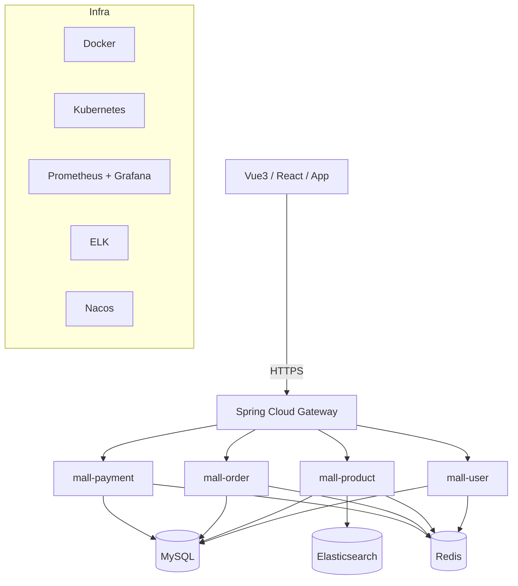

# Cloud Native Mall 架构说明

## 1. 项目定位

`cloud-native-mall` 是一个面向电商场景的云原生微服务骨架项目，核心目标：

- 通过服务拆分构建可扩展业务边界
- 通过网关统一鉴权、限流、熔断能力
- 通过容器与 K8s 支持标准化交付
- 通过观测体系提升运行可见性

## 2. 设计来源

- `aurora-mall`：从单体 Thymeleaf 架构迁移到前后端分离思路
- `talentflow-hr`：参考模块边界与聚合父 POM 的组织方式
- `DormLink`：按 token/JWT 方向落地认证组件（在本项目中实现为 `common-security`）

## 3. 分层架构

## 4. 模块边界

- `mall-gateway`：统一入口，负责 JWT 校验、租户访问控制、限流与服务发现路由
- `mall-user`：登录、用户资料、令牌签发
- `mall-product`：商品查询、检索入口，包含 Redis 缓存防击穿/防穿透逻辑
- `mall-order`：订单创建、查询、下单支付一体化事务入口
- `mall-payment`：支付确认与支付流水持久化
- `mall-common/common-core`：响应模型、分页模型
- `mall-common/common-security`：JWT 配置、签发与解析
- `mall-common/common-monitor`：请求 Trace 与 Actuator 监控扩展

## 5. 安全模型

- 用户登录由 `mall-user` 颁发 JWT
- 网关对除白名单外所有路径进行 token 校验
- 网关向下游服务透传 `X-User-Id`、`X-Username`、`X-User-Roles`
- 网关附加租户头校验、租户/IP 黑白名单控制
- 服务内当前为骨架级别放行，可继续补充细粒度 RBAC

## 6. 已落地增强

- 服务注册发现：网关路由已切换 `lb://service-name`，默认走 Eureka
- 分布式事务：订单链路 `@GlobalTransactional` + 支付服务本地事务
- 链路追踪：Micrometer Tracing + OTel Exporter + Jaeger OTLP
- 限流策略：网关限流键按 `tenant + user/ip` 组合构建
- 配置中心：已启用 Spring Cloud Config Client（可按环境接入配置服务）
